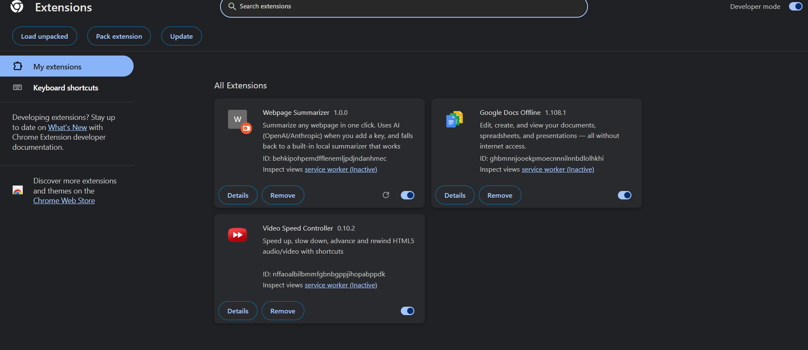
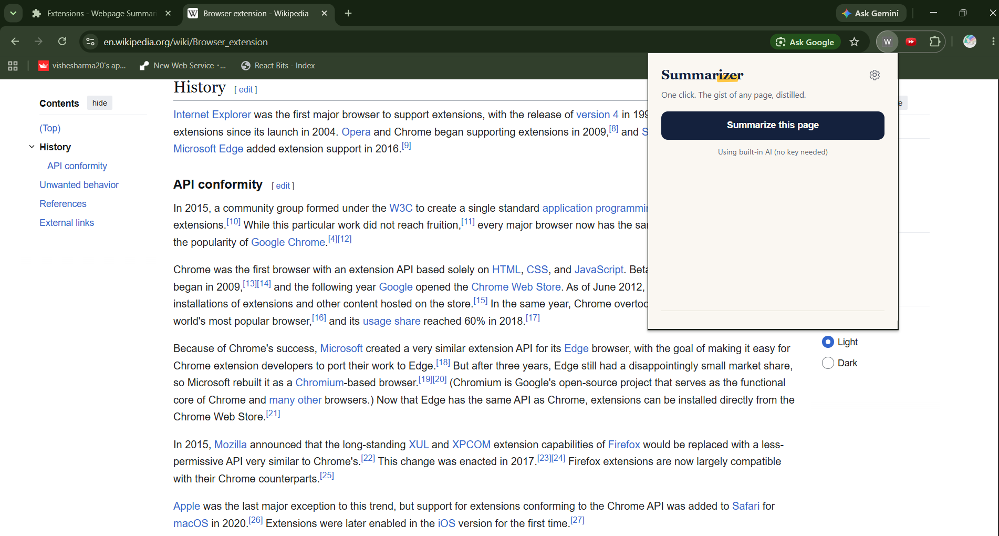
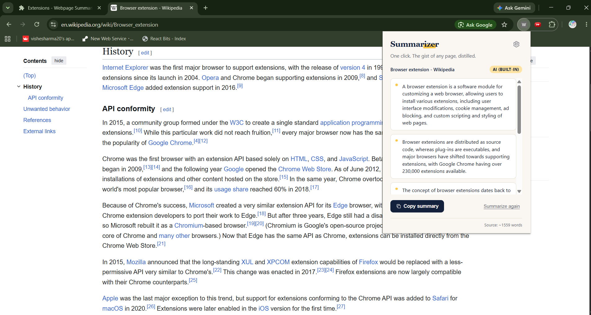
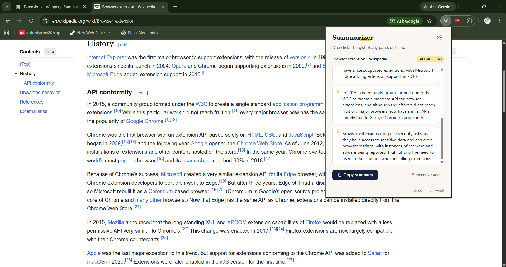
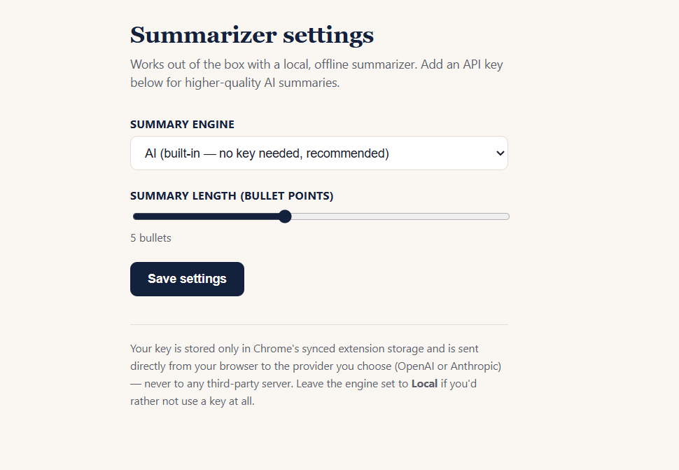
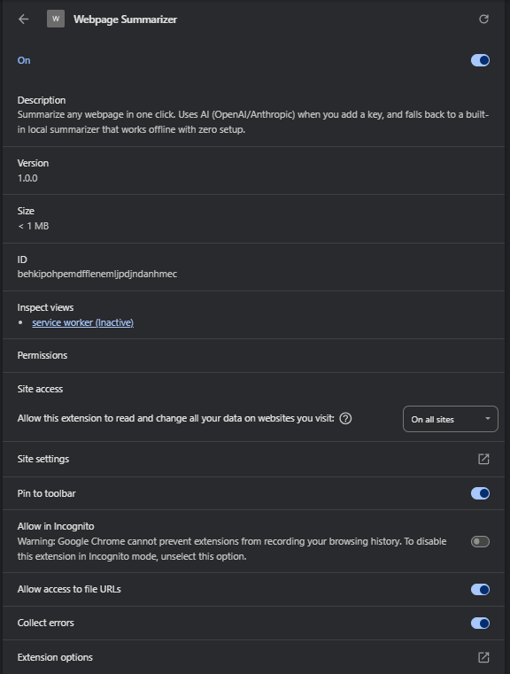

# Webpage Summarizer (Chrome Extension)

Click the icon, get a clean bullet-point summary of whatever page you're on, copy it in one tap.
Works **out of the box with zero setup** (a built-in local summarizer, no API key, no internet dependency for the summarization step itself) and can be upgraded to use **OpenAI** or **Anthropic (Claude)** for higher-quality AI summaries by adding your own API key in Settings.

---

## Live demo (GitHub Pages)

https://vishesharma20.github.io/web-page-summarizer-extension/

`docs/` contains a small landing page with an **interactive live demo** visitors
paste in some text and get a real AI summary back, calling the exact same
Cloudflare Worker backend as the extension. No install required to try it.

**To turn it on:**

1. Deploy the backend (see `backend/README.md`) if you haven't already.
2. Open `docs/script.js` and fill in the two constants at the top:
   ```js
   const PROXY_URL = "https://webpage-summarizer-proxy.yoursubdomain.workers.dev/summarize";
   const SHARED_SECRET = "the-same-secret-you-set-with-wrangler-secret-put";
   ```
3. Push to GitHub then go to your repo → **Settings → Pages** → under
   "Build and deployment", set **Source: Deploy from a branch**, branch
   `main`, folder `/docs`. Save.
4. GitHub gives you a live URL like `https://yourusername.github.io/web-page-summarizer-extension/` within a minute or two.

> Same tradeoff as the extension's proxy secret: since this page's JS is public,
> `SHARED_SECRET` is technically visible to anyone who views source. The Worker's
> per-IP and daily rate limits (in `backend/worker.js`) are what actually protect
> your Groq quota, the secret just filters out random bot traffic. If you want
> extra isolation between the demo page and the extension, deploy a second Worker
> with its own `SHARED_SECRET` and lower limits just for the demo.

## Screenshots

> Rename your files to avoid spaces (GitHub/Markdown links break on unescaped spaces)
> e.g. `summary 1.png` → `summary-1.png`, `summary 2.png` → `summary-2.png`.
> Then place them in a `screenshots/` folder at the project root and this section will render on GitHub.

| | |
|---|---|
| **Loading the extension** |  |
| **Opening it on a page** |  |
| **AI summary result** |  |
| **Scrolled summary** |  |
| **Settings page** |  |
| **Extension details** |  |

## Features

- One-click summarize from the toolbar popup
- Smart content extraction ignores nav bars, ads, footers, cookie banners, etc. and finds the actual article/body text
- **Built-in AI mode with zero user setup**: point `background.js` at your own deployed backend proxy (see `backend/`) and every user gets real AI summaries without ever entering a key
- Local, offline extractive summarizer (frequency + position scoring) as the always-available fallback — nothing to configure, works even if the proxy is down
- Optional bring-your-own-key mode (OpenAI, Groq, or Anthropic) for users who want unlimited/faster summaries under their own quota
- Automatic graceful fallback at every layer: hosted proxy fails → falls back to local; local always works
- Copy-to-clipboard in one click
- Adjustable summary length (3–8 bullets)
- Clean, distinct UI (not a default Bootstrap look), good for a portfolio/demo screenshot

## Folder structure

```
webpage-summarizer-extension/
├── manifest.json          # MV3 manifest
├── background.js          # service worker: routes summarize requests, calls hosted proxy / AI APIs
├── content.js              # injected into the page to extract readable text
├── lib/
│   └── summarizer.js      # local, dependency-free extractive summarizer
├── popup/
│   ├── popup.html
│   ├── popup.css
│   └── popup.js           # popup UI logic / state machine
├── options/
│   ├── options.html
│   ├── options.css
│   └── options.js         # settings page (engine + API key + summary length)
├── backend/
│   ├── worker.js           # Cloudflare Worker: holds YOUR Groq key server-side
│   ├── wrangler.toml
│   └── README.md           # deploy steps, do this once, then every user gets free AI summaries
└── icons/                  # optional custom toolbar icon (binary PNGs download the zip, not copy/paste)
    ├── icon16.png
    ├── icon32.png
    ├── icon48.png
    └── icon128.png
```

## Giving every user real AI summaries with no key of their own

By default the popup's **"AI (built-in)"** option calls a backend proxy URL
that's empty until you set it up, until then it silently falls back to the
local summarizer, so nothing breaks. To turn on real AI for everyone:

1. Follow `backend/README.md` to deploy the free Cloudflare Worker (holds
   your Groq key, never exposed to users).
2. Paste the Worker URL and shared secret into the two constants at the top
   of `background.js`.
3. Reload the extension. Done, no user ever sees or enters an API key.

> **Before pushing to GitHub:** if this repo is public, revert the two
> constants in `background.js` (`DEVELOPER_PROXY_URL` and
> `EXTENSION_SHARED_SECRET`) back to empty strings before committing, and
> keep your filled-in version only on your own machine (or in a
> `.gitignore`'d file). Committing your real values doesn't expose your Groq
> key — that's safe on Cloudflare — but it does hand out your Worker's URL
> and shared secret to anyone browsing the repo, letting them ride on your
> free-tier rate limit. Low stakes for a demo project, but good practice.

## Install (load unpacked, ~1 minute)

1. Download/clone this folder onto your machine.
2. Open Chrome and go to `chrome://extensions`.
3. Turn on **Developer mode** (top-right toggle).
4. Click **Load unpacked** and select the `webpage-summarizer-extension` folder.
5. Pin the extension (puzzle-piece icon in the toolbar → pin "Webpage Summarizer").
6. Open any article/blog/news page, click the icon, click **Summarize this page**.

That's it no build step, no npm install. It's plain HTML/CSS/JS so it's easy to read and easy to demo in an interview.

## Using AI mode (optional, for better summaries)

By default the extension uses the built-in local summarizer. To use a real LLM:

1. Click the gear icon in the popup (or right-click the extension icon → Options).
2. Choose **OpenAI** or **Anthropic** as the engine.
3. Paste in your API key:
   - OpenAI: create one at https://platform.openai.com/api-keys
   - Anthropic: create one at https://console.anthropic.com/settings/keys
4. Click **Save settings**.

Your key is stored only in `chrome.storage.sync` (Chrome's own encrypted, per-profile extension storage) and is sent directly from your browser to the provider you picked — this project has no backend server of its own, so there's nowhere else for the key to go. If you'd rather not use a key, just leave the engine on **Local**; the extension is fully functional without one.

## How it works

1. **`content.js`** is injected into the active tab on demand. It scores block-level elements on the page (favoring text-dense areas, penalizing link-heavy or nav/footer-like elements based on id/class hints) to find the main content, strips scripts/styles/ads, and returns clean plain text plus the page title/URL.
2. **`popup.js`** requests that extraction, then sends the page data to the background service worker.
3. **`background.js`** checks your saved settings:
   - If an AI provider + key is configured, it calls that provider's API with a prompt asking for N concise bullet points grounded only in the page text.
   - Otherwise (or if the API call fails), it runs **`lib/summarizer.js`** a frequency-weighted extractive summarizer: it tokenizes sentences, scores words by frequency (minus stopwords), scores sentences by their average word score with a small boost for early/lead sentences, and returns the top-N sentences **in their original order** so the summary still reads coherently.
4. The popup renders the bullets, lets you copy them, and shows which engine produced the result.

## Why this is a good portfolio/resume project

- Demonstrates Chrome Extension Manifest V3 architecture (service workers, message passing, `chrome.scripting`, `chrome.storage`)
- Demonstrates DOM parsing / content-extraction heuristics (a mini "readability" algorithm)
- Demonstrates a real NLP technique implemented from scratch (extractive summarization) with no dependencies
- Demonstrates external API integration (OpenAI + Anthropic) with proper error handling and graceful degradation
- Clean, intentional UI not a default template
- Fully self-contained: reviewers can `git clone` + "Load unpacked" and have it working in under a minute

## Possible extensions (good talking points in an interview)

- Add a context-menu / keyboard-shortcut trigger
- Cache summaries per-URL in `chrome.storage.local` so re-opening a page is instant
- Add a "summarize selected text only" mode
- Publish to the Chrome Web Store (needs a developer account + small one-time fee)
- Swap the local summarizer for a lightweight in-browser transformer model (e.g. via `transformers.js`) for offline AI-quality summaries

## Troubleshooting

- **"This page can't be read by the extension"** Chrome blocks extensions from running on internal pages like `chrome://extensions`, the Web Store, or the new-tab page. Try it on a regular website.
- **Empty or odd summary**: very short pages, paywalled pages, or pages that render content client-side after a delay may not have enough extractable text on first load. Try reloading the page, then summarizing.
- **AI mode returns an error**: check the key is correct and has available quota/billing on the provider's dashboard; the extension will automatically fall back to the local summarizer either way.